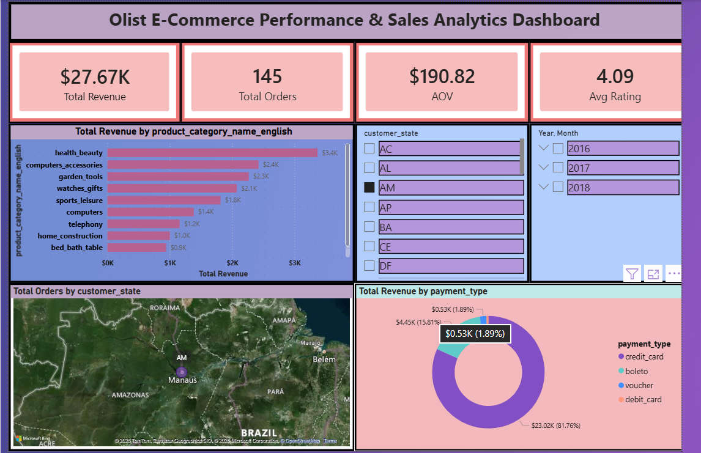

# 🛒 Olist E-Commerce Performance & Sales Analytics

## 📝 Project Overview
Developed an end-to-end sales analytics pipeline for **Olist**, a Brazilian e-commerce giant. The goal was to analyze over 100,000 anonymized orders to extract actionable business insights regarding sales trends, logistics performance, and customer satisfaction.

The project involves rigorous data cleaning using **Python (Pandas)**, complex exploratory data analysis (EDA) using **SQL**, and the development of an interactive executive dashboard using **Power BI** with advanced DAX measures.

## 📊 Executive Dashboard

## 🛠️ Tech Stack & Tools
* **Data Visualization:** Power BI (DAX, Data Modeling)
* **Database Engine:** PostgreSQL
* **Data Processing:** Python (Pandas/NumPy)
* **Key Techniques:** CTEs, Window Functions, Star Schema, KPI Engineering.

## 💡 Key Business Insights
Through complex SQL queries and visual analysis, the following insights were uncovered:
1. **Revenue & Growth:** Analyzed overall revenue generation and month-over-month sales trends, identifying peak shopping seasons.
2. **Category Performance:** Discovered that *Health & Beauty* and *Bed Bath & Table* were among the top revenue-generating product categories.
3. **Logistics & Geography:** Mapped the highest concentration of orders to the São Paulo (SP) state and identified average delivery delays.
4. **Payment Preferences:** Evaluated the distribution of payment methods (Credit Card vs. Boleto) used by customers.

## 📁 Repository Contents
* `Oilest Dashboard.pbix`: The complete Power BI project file containing the data model, DAX measures, and visuals.
* `SQL_Query.sql`: Contains the business questions and their optimized SQL solutions.
* `dashboard.png`: High-resolution snapshot of the final interactive dashboard.
* Data files (`geolocation_clean.csv`, `payments_clean.csv`, `merge_data_final.zip`).

---
### 👨‍💻 Author
**Nishant Kumar**
*B.Tech Computer Science and Engineering (Class of 2026)* | *Data Analytics & Machine Learning Enthusiast*

* **GitHub:** [https://github.com/Nishant9568](https://github.com/Nishant9568)
